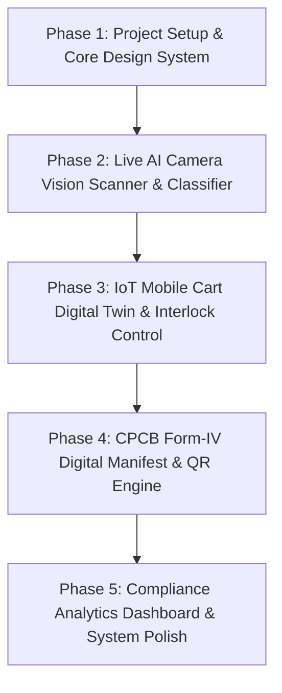

# MediTrace OS - Development Roadmap

## Phase Structure

---

### Phase 1: Foundation & Core Design System
- **Goal**: Initialize Next.js app, configure custom design system tokens, typography, glassmorphism theme, layout components, and base state management.
- **Deliverables**:
  - Next.js application scaffolded with TypeScript & CSS design tokens.
  - Dark medical OS theme with BMWM 2016 color tokens.
  - Header, Navigation Sidebar, Status Bar components.
  - Web Speech API integration utility for voice directives (EN/HI).

### Phase 2: Live AI Camera Vision Scanner & Classifier
- **Goal**: Build camera viewport interface, Gemini Vision API integration, mock sample scanner fallback, instant bin classifier logic, and pathogen risk badges.
- **Deliverables**:
  - Live video stream / photo upload scanner interface.
  - Gemini API route for image classification with BMWM 2016 rules.
  - Item detail card (waste category, target bin, pathogen level, disposal instructions).
  - Voice directive trigger upon classification.

### Phase 3: Simulated IoT Mobile Cart Digital Twin & Interlock Control
- **Goal**: Build interactive mobile cart visual digital twin with dynamic lid interlocks, weight telemetry load cell simulations, audio alarms, and cross-contamination alert system.
- **Deliverables**:
  - Animated digital cart HUD showing 4 bins (Yellow, Red, Blue, White).
  - Lid actuator status indicators (`LOCKED` / `UNLOCKED`).
  - Interactive weight controls / simulated weight addition.
  - Overcapacity (80%+ warning) and cross-contamination warning modal & sound triggers.

### Phase 4: CPCB Form-IV Digital Manifest & QR Serialization Engine
- **Goal**: Create automated CPCB Form-IV compliance manifest generator, shift end summary dialog, QR code generator, and printable manifest view.
- **Deliverables**:
  - Shift summary aggregator.
  - CPCB Form-IV official template layout.
  - QR Code generation displaying manifest payload and cryptographic verification hash.
  - Export/Print manifest feature.

### Phase 5: Compliance Analytics Dashboard & Polish
- **Goal**: Build real-time analytics dashboard with segregation accuracy stats, volume trends chart, audit log table, mobile responsiveness, and end-to-end integration testing.
- **Deliverables**:
  - Ward compliance overview cards & charts.
  - Detailed audit log table with filter & search capabilities.
  - Full application end-to-end testing and visual refinement.
